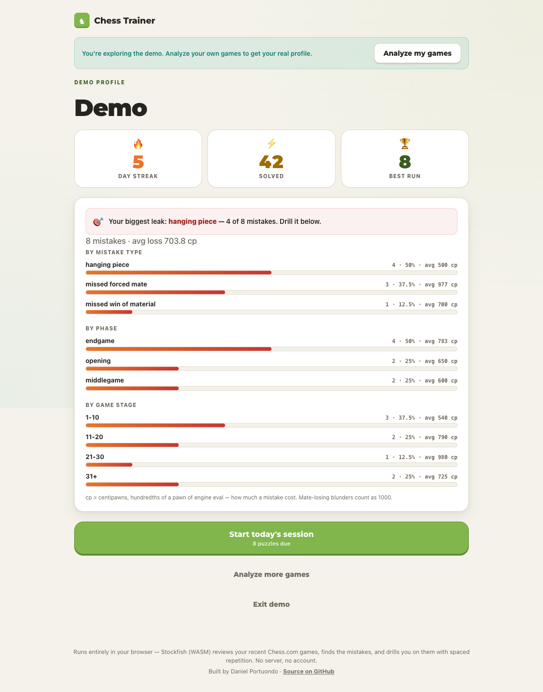
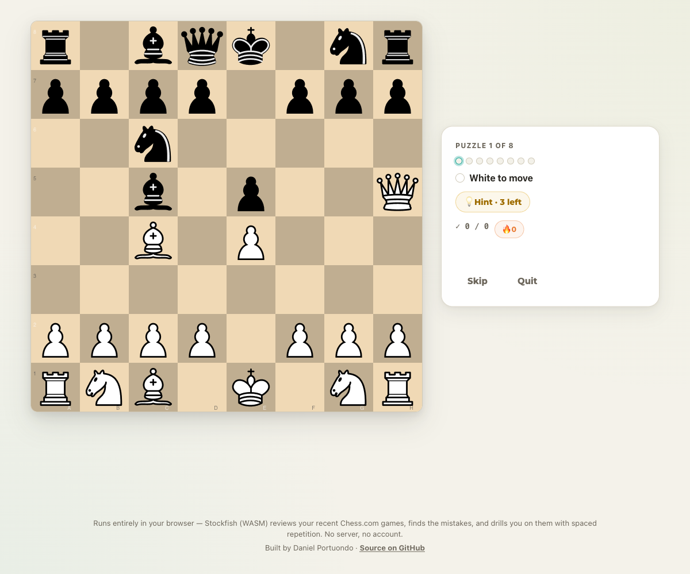

# Personalized Chess Trainer

[](https://github.com/danielportuondo/personalized-chess-trainer/actions/workflows/ci.yml)

Stockfish reviews your recent Chess.com games, finds the exact moves where you threw the game away, and turns them into a personalized tactics workout — entirely in your browser. No server, no account; your games never leave your machine.

**Live app: [personalized-chess-trainer.pages.dev](https://personalized-chess-trainer.pages.dev)** — or hit "Explore the demo" to try it without a Chess.com handle.

| Your weakness profile | Drilling your own blunders |
| --- | --- |
|  |  |

## How it works

1. **Fetch** your recent games from the Chess.com public API.
2. **Analyze** every move you played with Stockfish at depth 12 (WASM in a Web Worker on the web; local binary in the CLI).
3. **Extract** puzzles from moves that lost ≥ 150 centipawns in positions that were still winnable, deduplicating repeated positions.
4. **Classify** each mistake into a motif: missed forced mate, allowed forced mate, hanging piece, missed win of material.
5. **Profile** your weaknesses by motif, game phase, and move number.
6. **Drill** curated clean tactics — each line trimmed to the moment the payoff (mate or ≥ 2 pawns of material) is on the board, gated on solution uniqueness via a MultiPV=2 re-check, served easiest-first, and scheduled with SM-2 spaced repetition.

The thresholds aren't guesses: [docs/evaluation.md](docs/evaluation.md) validates the CPL cutoff, the uniqueness gap, and the difficulty ordering against a database of my own analyzed games.

## Architecture

Two implementations of one spec:

|  | Python CLI (`src/chess_trainer/`) | Web app (`web/`) |
| --- | --- | --- |
| Role | Reference implementation | Full client-side port |
| Engine | Local Stockfish binary | stockfish WASM in a Web Worker |
| Chess logic | python-chess | chessops |
| Storage | SQLite | IndexedDB |
| Interface | Terminal | Vanilla TypeScript + chessground |

The CLI came first as the pipeline sandbox; the web app exists so anyone can use the trainer with zero install. Porting forced spec-level precision — parity is pinned by tests down to rounding semantics (SQLite's half-away-from-zero `ROUND()` vs Python's banker's `round()`).

## Run it

**Web** (Node 22):

```sh
cd web
npm install
npm run dev
```

**CLI** (Python 3.12, [uv](https://docs.astral.sh/uv/), a local [Stockfish](https://stockfishchess.org/) binary):

```sh
cp .env.example .env   # set your Chess.com username + stockfish path
uv sync
uv run chess-trainer pipeline   # ingest -> analyze -> extract -> profile
uv run chess-trainer train      # drill puzzles in the terminal
```

## Tests

CI runs both suites on every push: **232 vitest** tests for the web app and **22 pytest** tests for the CLI, plus `tsc`, a production build, and `ruff`.

```sh
cd web && npm test    # vitest
uv run pytest         # python
```

## Built with AI, verified like production code

Every commit in this repo is co-authored with Claude, and I'd rather own that than hide it: alongside its day job as my tactics coach, this project is deliberate practice in supervising AI coding agents with production discipline. I set direction and make the product and modeling decisions; the agent implements; nothing lands without passing typecheck and both test suites, and UI work additionally gets a scripted Playwright drive of the real app. The evaluation memo in [docs/evaluation.md](docs/evaluation.md) applies the same standard to the modeling side — no threshold ships unmeasured.

## License

[MIT](LICENSE)
